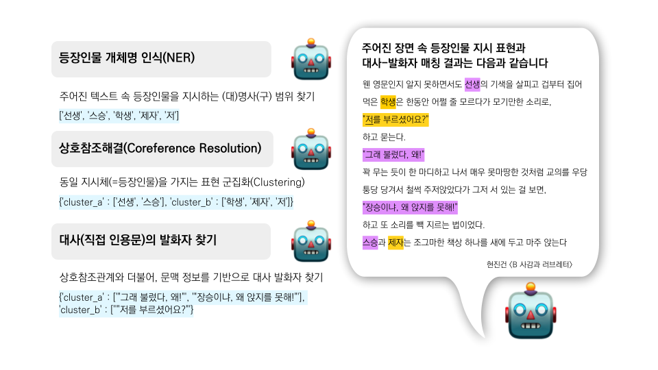

# KoBookNLP
KoBookNLP는 한국어 소설을 위한 자연어처리 라이브러리로 다음과 같이 구성되어 있습니다.
* 등장인물명 개체인식(Name Entity Recognition, NER)
* 상호참조해결(Coreference Resolution, Coref)
* 대사의 발화자 찾기(Direct Quotation Assignment, Speaker Identification)

※현재는 데이터셋 KoCoNovel만 공개 중

## (Introduction) 데이터셋 소개
